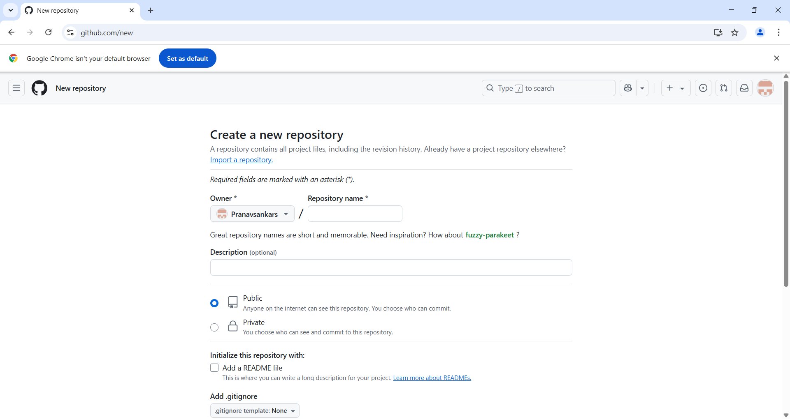

# head 1

### Technologies used
- html
- css 
- java

1. list 1
2. list 2

[live@](https://www.google.co.in/)



```java
public class Hello{
    public static void main(String[] args){
        System.out.print("hello wolrd);
        
    }
}

```

